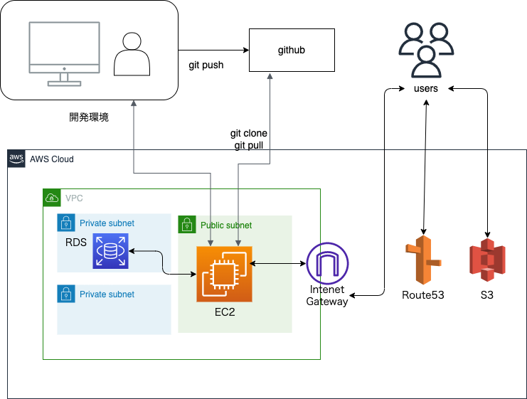

# キタチョク

## 1.URL
- AWSデプロイURL：http://kitachoku.net/

## 2.概要
北海道の農産物直売所情報サイト

## 3.制作背景・目的
- 北海道をドライブするのが好きなのですが、その際「直売所で野菜を買いたいが、道の駅以外どこで買ったらいいかわからない」という声があったこと。
- 前職が農業関係だったのですが、農家個人で販売している直売所や、小さい母体の直売所など、美味しいものを売っているのにあまり知られていないところがありました。
そういったところにアクセスしやすいポータルサイトを作り、知名度を上げることで、農家さんの収入に少しでも貢献したいという思いがあること。

## 4.使用画面のイメージ
### トップページ

### 会員登録ページ 

### ログインページ

### 検索結果画面

### マイページ

### ユーザー設定変更ページ

### 口コミレビュー編集ページ

## 5.使用技術、バージョン
- フロントエンド
  - HTML / CSS / JavaScript
  - jQuery 3.5.1

- バックエンド
  - PHP 8.1.7
  - Laravel 8.83.23

- インフラ、その他
  - MySQL 5.7.34
  - AWS（VPC、EC2、Route 53、RDS、S3、IAM）(本番環境)
  - Apache 2.4.54（本番環境）
  - Visual Studio Code
  - draw.io

## 6.環境構築手順
1. GitHubよりダウンロード

`$ git clone https://github.com/jing-bay/kitachoku.git`

※コピーしたディレクトリ内を確認した時、README.mdだけがディレクトリ内に存在する場合、「cd」コマンドでコピーしたディレクトリに移動後、以下のようにコマンドを入力します。

`$ git checkout main`

2. composerをインストールする

`$ composer install`

3. .env を作る

`$ cp .env.example .env `

4. MySQLなどにログインしてDBを作る

DB名：kitachoku

5. .envのAPP_KEY を作る

`$ php artisan key:generate`

6. .envの中身を変更する

- APP周り

APP_NAME = キタチョク

APP_URL=http://localhost:8000

- DB周り

DB_CONNECTION=mysql

DB_HOST=127.0.0.1

DB_PORT=3306

DB_DATABASE=resedb

DB_USERNAME=root

DB_PASSWORD=root

- メール認証周り（MailTrapのアカウントを持っていること）

MAIL_MAILER=smtp

MAIL_HOST=smtp.mailtrap.io

MAIL_PORT=2525

MAIL_USERNAME="mailtrapのユーザー名"

MAIL_PASSWORD="mailtrapのパスワード"

MAIL_ENCRYPTION=tls

7. マイグレーション、シーディングを行う

`$ php artisan migrate`

`$ php artisan db:seed`

8. storage>app>public直下にshopimgディレクトリを作り、以下の画像を`kitachokulogo.001-removebg-preview.jpg`の名前で保存する

[kitachokulogo 001-removebg-preview](https://user-images.githubusercontent.com/95161114/195748199-4134fb1e-f409-4d94-8eea-08c8193eaa02.jpg)

9. ファイルの中でサーバーを立ち上げる

`$ php artisan serve`

## 7.機能一覧
- ユーザー登録関連
  - ログイン・ログアウト
  - 会員登録の際メール認証する
- 直売所表示関連
  - 飲食店一覧取得
  - 飲食店詳細取得
  - 飲食店検索機能（エリア・タグ・キーワード）
- マイページ・ログイン後の機能関連
  - 飲食店お気に入り(登録・削除)
  - 飲食店予約情報(追加・変更・削除)
  - 評価機能(追加・変更・削除)
  - ユーザー情報の変更
- 店舗代表者機能関連
  - ログイン・ログアウト
  - 会員登録の際メール認証する
  - 代表者情報の設定（変更、削除）
  - 店舗情報登録、設定（変更、削除）
  - 予約一覧（確認、削除）
  - クーポン（登録、削除）
- 管理者（サイト運営）機能関連
  - ログイン・ログアウト
  - 会員登録の際メール認証する
  - 管理者情報の設定（変更、削除)
  - 店舗情報（検索、設定変更、削除）
  - 店舗代表者情報(検索、設定変更、削除)
  - ユーザー情報(検索、設定変更、削除)
  - 新着情報（追加、削除）

## 8.苦労した点
- マルチログイン関連
- AWS EC2へのデプロイ：そもそもインフラの構造から学ばなくてはならなかったため、そこに至るまでがとても大変でした。
- S3へのバケットへ画像ファイル保存：保存ができなかったり、保存ができても削除ができなかったり、保存したはずの画像が表示されないこともありました。
Herokuの無料プランが終了するため、AWSへのデプロイは覚えておいてよかったです。

## 9.DB設計
### ER図

### テーブル設定
- usersテーブル
ユーザーを管理する。

| カラム名          | 属性                                 | 役割                                   |
| ----------------- | ------------------------------------ | -------------------------------------- |
| id                | unsigned bigint/PRIMARY KEY/NOT NULL | ユーザーを識別する ID                  |
| name              | varchar(255)/NOT NULL                | ユーザー名                             |
| nickname          | varchar(255)/NOT NULL                | ニックネーム                             |
| email             | varchar(255)/UNIQUE KEY/NOT NULL     | メールアドレス                         |
| email_verified_at | timestamp                            | メール認証用                           |
| password          | varchar(255)/NOT NULL                | パスワード                             |
| remember_token    | varchar(100)                         | ユーザーのトークンを格納するために使用 |
| created_at        | timestamp                            | 作成日時                               |
| updated_at        | timestamp                            | 更新日時                               |

- areasテーブル
エリアを管理する。

| カラム名          | 属性                                 | 役割                                   |
| ----------------- | ------------------------------------ | -------------------------------------- |
| id                | unsigned bigint/PRIMARY KEY/NOT NULL | エリアを識別する ID                  |
| name              | varchar(255)/NOT NULL                | エリア名                             |
| created_at        | timestamp                            | 作成日時                               |
| updated_at        | timestamp                            | 更新日時                               |

- tagsテーブル
タグを管理する。

| カラム名          | 属性                                 | 役割                                   |
| ----------------- | ------------------------------------ | -------------------------------------- |
| id                | unsigned bigint/PRIMARY KEY/NOT NULL | タグを識別する ID                  |
| name              | varchar(255)/NOT NULL                | タグ名                             |
| created_at        | timestamp                            | 作成日時                               |
| updated_at        | timestamp                            | 更新日時                               |

- noticesテーブル
新着情報を管理する。

| カラム名          | 属性                                 | 役割                                   |
| ----------------- | ------------------------------------ | -------------------------------------- |
| id                | unsigned bigint/PRIMARY KEY/NOT NULL | 新着情報を識別する ID                  |
| content           | varchar(255)/NOT NULL                | 新着情報の内容                           |
| created_at        | timestamp                            | 作成日時                               |
| updated_at        | timestamp                            | 更新日時                               |

- shop_adminsテーブル
店舗代表者を管理する。

| カラム名          | 属性                                 | 役割                                   |
| ----------------- | ------------------------------------ | -------------------------------------- |
| id                | unsigned bigint/PRIMARY KEY/NOT NULL | 店舗代表者を識別する ID                  |
| name              | varchar(255)/NOT NULL                | 店舗代表者名                             |
| email             | varchar(255)/UNIQUE KEY/NOT NULL     | メールアドレス                         |
| email_verified_at | timestamp                            | メール認証用                           |
| password          | varchar(255)/NOT NULL                | パスワード                             |
| remember_token    | varchar(100)                         | トークンを格納するために使用 |
| created_at        | timestamp                            | 作成日時                               |
| updated_at        | timestamp                            | 更新日時                               |

- adminsテーブル
管理者を管理する。

| カラム名          | 属性                                 | 役割                                   |
| ----------------- | ------------------------------------ | -------------------------------------- |
| id                | unsigned bigint/PRIMARY KEY/NOT NULL | 管理者を識別する ID                  |
| name              | varchar(255)/NOT NULL                | 管理者名                             |
| email             | varchar(255)/UNIQUE KEY/NOT NULL     | メールアドレス                         |
| email_verified_at | timestamp                            | メール認証用                           |
| password          | varchar(255)/NOT NULL                | パスワード                             |
| remember_token    | varchar(100)                         | トークンを格納するために使用 |
| created_at        | timestamp                            | 作成日時                               |
| updated_at        | timestamp                            | 更新日時                               |

- shopsテーブル
店舗を管理する。

| カラム名          | 属性                                 | 役割                                   |
| ----------------- | ------------------------------------ | -------------------------------------- |
| id                | unsigned bigint/PRIMARY KEY/NOT NULL | 店舗を識別する ID                  |
| name              | varchar(255)/NOT NULL                | 店舗名                             |
| shop_admin_id     | unsigned bigint/NOT NULL/FOREIGN KEY | 店舗代表者id                         |
| area_id　　| unsigned bigint/NOT NULL/FOREIGN KEY         | エリアid                          |
| postal_code          | char(7)/NOT NULL                | 郵便番号                            |
| address    | varchar(255)                         | トークンを格納するために使用 |
| opening_hour        | varchar(255)/NOT NULL      | 営業時間                            |
| holiday        | varchar(255)/NOT NULL                    | 定休日                               |
| tel_number        | varchar(255)/NULLABLE          | 電話番号                               |
| email        | varchar(255)/NULLABLE             | メールアドレス                               |
| overview        | text/NOT NULL                        | 店舗説明                               |
| shop_img        | varchar(255)/NOT NULL               | 店舗画像                               |
| shop_url        | varchar(255)/NULLABLE         | 店舗サイトURL                               |
| facebook_url        | varchar(255)/NULLABLE             | FacebookURL                               |
| twitter_url        | varchar(255)/NULLABLE        | TwitterURL                               |
| created_at        | timestamp                            | 作成日時                               |
| updated_at        | timestamp                            | 更新日時                               |

- favoritesテーブル
お気に入り登録を管理する。

| カラム名          | 属性                                 | 役割                                   |
| ----------------- | ------------------------------------ | -------------------------------------- |
| id                | unsigned bigint/PRIMARY KEY/NOT NULL | お気に入りを識別する ID                  |
| shop_id           | unsigned bigint/NOT NULL/FOREIGN KEY | 店舗id                           |
| user_id           | unsigned bigint/NOT NULL/FOREIGN KEY | ユーザーid                           |
| created_at        | timestamp                            | 作成日時                               |
| updated_at        | timestamp                            | 更新日時                               |

- shop_tagテーブル
shopsテーブルとtagsテーブルの中間テーブル（多対多リレーション）

| カラム名          | 属性                                 | 役割                                   |
| ----------------- | ------------------------------------ | -------------------------------------- |
| id                | unsigned bigint/PRIMARY KEY/NOT NULL | 中間テーブルのデータを識別するID          |
| tag_id           | unsigned bigint/NOT NULL/FOREIGN KEY  | タグid                           |
| shop_id           | unsigned bigint/NOT NULL/FOREIGN KEY | 店舗id                           |
| created_at        | timestamp                            | 作成日時                               |
| updated_at        | timestamp                            | 更新日時                               |

- couponsテーブル
クーポンを管理する。

| カラム名          | 属性                                 | 役割                                   |
| ----------------- | ------------------------------------ | -------------------------------------- |
| id                | unsigned bigint/PRIMARY KEY/NOT NULL | クーポンを識別する ID                  |
| shop_id           | unsigned bigint/NOT NULL/FOREIGN KEY | 店舗id                           |
| name              | varchar(255)/NOT NULL                | クーポン名                           |
| created_at        | timestamp                            | 作成日時                               |
| updated_at        | timestamp                            | 更新日時                               |

- reservationsテーブル
予約情報を管理する。

| カラム名          | 属性                                 | 役割                                   |
| ----------------- | ------------------------------------ | -------------------------------------- |
| id                | unsigned bigint/PRIMARY KEY/NOT NULL | 予約情報を識別する ID                  |
| user_id           | unsigned bigint/NOT NULL/FOREIGN KEY | ユーザーid                           |
| reservation_date  | date/NOT NULL                        | 予約日                          |
| reservation_time  | time/NOT NULL                        | 予約時間                          |
| coupon_id         | unsigned bigint/NOT NULL/FOREIGN KEY | クーポンid                           |
| created_at        | timestamp                            | 作成日時                               |
| updated_at        | timestamp                            | 更新日時                               |

- evaluationsテーブル
評価を管理する。評価は予約した店舗に行った後のみ行える

| カラム名          | 属性                                 | 役割                                   |
| ----------------- | ------------------------------------ | -------------------------------------- |
| id                | unsigned bigint/PRIMARY KEY/NOT NULL | 評価を識別する ID                  |
| reservation_id    | unsigned bigint/NOT NULL/FOREIGN KEY | ユーザーid                           |
| evaluation        | unsigned tinyint/NOT NULL            | 評価                          |
| comment           | text/NOT NULL                        | コメント                          |
| created_at        | timestamp                            | 作成日時                               |
| updated_at        | timestamp                            | 更新日時                               |

## 10.インフラ構成図
